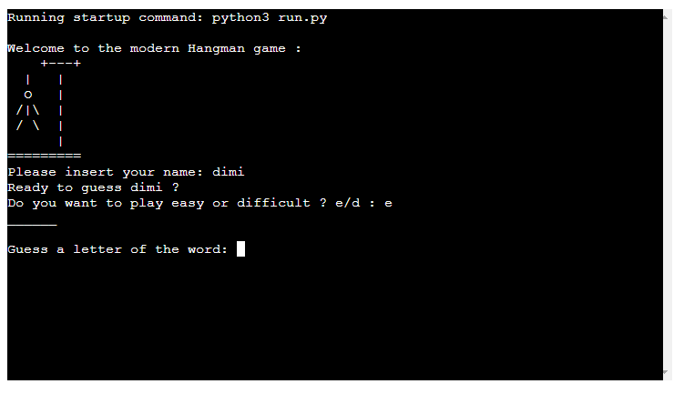
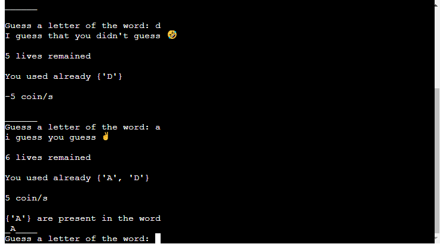
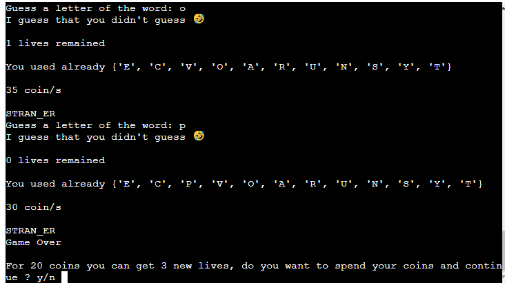

# Hangman 
Hangman is a Python version of the homonymous traditional game with the opportunity of 2 different levels, coins inside the game that are used in exchange for new lives when the standard ones are finished.
In this game, the user can challenge himself to guess a random word chosen from the program.

If you want to try the game here is the link - https://hangman-eng.herokuapp.com/

## How to play:

The user is welcomed with a message then:

* To start the user need to enter his name
* The second choice that the user needs to do is the difficulty which can be easy(e) or difficult(d)
* At this point the program chooses a word that can be <7 if the user chooses easy mode or >7 if the hard mode
* From here the user chooses a letter every round to see if is part of the hidden word.
* If the letter is inside the word on the terminal is shown the current word with the letter guessed in the respective position
* Every round the lives increase (onòy easy mode) or decrease based on the presence or not of the letter in the word
* Same thing for the coins
* If the number of lives reaches 0 there are 2 possible consequences:
    1. If the user has enough coins (10 for easy mode and 20 for hard mode) can spend them to receive 5 (e) or 3 (d)
    2. Else if the user doesn't have enough coins the game finish and the user can restart the game
* Finally if the user wants to close the program can answer 'N' on the input at the end of the match.

# Features
## Existing features
* Personalized challenge message
    1. After the user insert the name printed on the terminal a message containing the user name
* Opportunity to choose the difficulty with which play
    1. The user can challenge himself if the standard easy mode is too simple.
    2. With the hard mode the user can find a more complex game without sacrificing the fun.
* Random choice of a word to guess
    1. The program chooses a word between 50 different words creating the word to be guessed with an underscore for every letter.

    

* Visual demonstration of letter guessed
    1. Every letter guessed replaces the underscore in the word shown
* Different message if the letter is present or not in the word
    1. If the letter chosen is part of the word the user choice is added to the set of letters present and then print in the terminal to give to the user the opportunity to keep on track of the letter guessed.
    2. If the letter is not present the user choice instead is added to a different set of letters that shows to the user the letter already used but not in the word giving a full tracking of the letters in the current game.
* Presence of a coins reward
    1. Whenever the user guesses a letter the program rewards him with 10 coins that at the end of the game if the user loses all the lives can spend to buy new lives to go ahead and finally guess the current word.

* Replay and proceed opportunity
    1. As cited before when the word is complete or the lives counter reaches 0 the user has the chance to restart the game with a new random word, the same word spending the virtual coins gained during the current match or exit from the game and shut the program.

## Future features
* Start the game with words in different languages to give an extra challenge
* Expand the number of words that the program can choose

# Testing

I have manually tested my code:
* Passed the code through PEP8 not experiencing any main problems
* Given invalid input messages: different letters than e or d when asked to choose a difficulty, different letters than y or n when asked to continue the game or spend the coins, numbers instead of strings when asked for the name or the letter present in the word, blank input in the user_choice or user_name.
* Tested in my local terminal and in the Code Institute Heroku terminal

# Bugs

## Solved bugs
* Found a bug that after getting the first invalid input leaves the user to insert again an invalid input but this time passes it as valid input and as a result of being printed on the terminal, fixed with a while loop that checks that the user input is only 1 letter and until the input don't match the game doesn't go ahead.,
* Found a bug in the username and user choice input that accepts numbers too, fixed with the string method isalpha() that returns False if inside the input is present numbers, added so a while loop that passes the input to check the presence of numbers and if so print on the terminal an invalid input message.

## Remaining bugs
* For the moment any other bugs are discovered

## Validator Testing

* Passed the code through PEP8 and no main error was detected.

# Deployment

This project was deployed using Code Institute's mock terminal for Heroku.

* Steps for deployment:
    1. Push the code done on GitHub
    2. Create a New Heroku app
    3. Connect your GitHub account to your Heroku account
    4. Select the repository 
    5. Set the build back to Python and NodeJS in that order
    6. Click on Deploy.

# Credits

* Code Institute for the deployment terminal
* code golf for the hangman ASCII art.
* My mentor Jack Wachira for his precious advice and the essential preliminary chat for every project I develop since the start of his mentoring.

 

